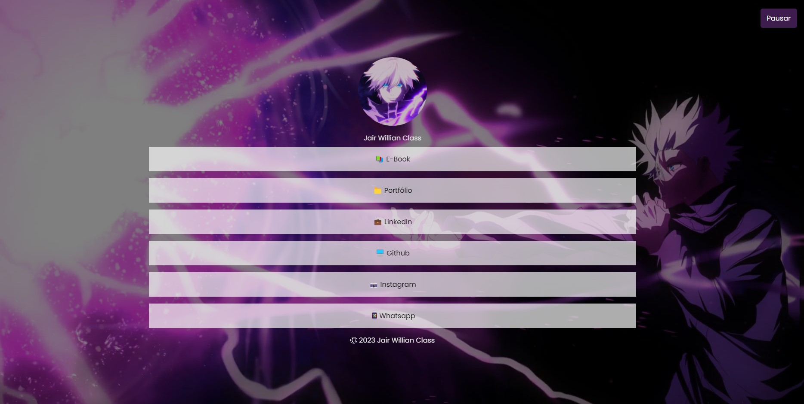
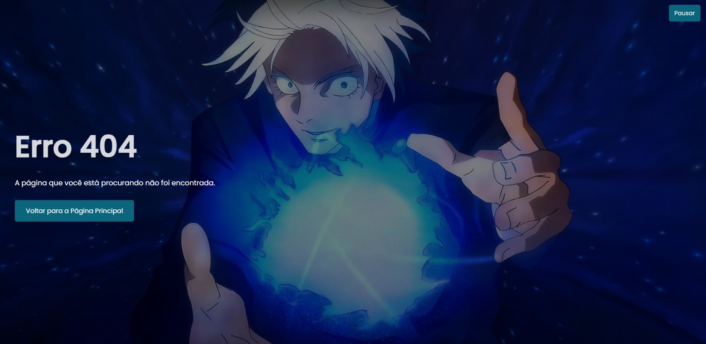

<h1 align="center"> 
	Página de Linktree
</h1>

  
	
  <a href="https://img.shields.io/github/stars/jairclass?style=social">
    

## 💻 Sobre o projeto
Este projeto é uma página de Linktree personalizada, criada com o objetivo de praticar e demonstrar habilidades em HTML, CSS e JavaScript. A página serve como um hub centralizado para links importantes, permitindo um acesso fácil a diferentes plataformas e redes sociais.

---

## 🎨 Layout

O layout da aplicação:

  

  

  

  

  
				      
---

## 🛠 Tecnologias

As seguintes ferramentas foram usadas na construção do projeto:

#### **Website** 

- HTML: utilizado para estruturação da página, incluindo uso de atributos, tags básicas, tabelas e outras estruturas HTML.

- CSS: empregado para estilização, incluindo layouts com flexbox, animações, pseudo-elementos e responsividade.

- JavaScript: usado para adicionar interatividade à página.

#### **Utilitários**

-   Editor:  **[Visual Studio Code](https://code.visualstudio.com/)**  
-   Fontes:  **[Poppins](https://fonts.googleapis.com/css2?family=Poppins:wght@300;400;500&display=swap)**
-   Servidor:  **[Xampp](https://www.apachefriends.org/pt_br/download.html)**

---

## 🦸‍♂️ Autor

<a href="https://github.com/jairclass">
 
  
 <b>Jair Willian Class</b></a> <a href="https://avatars.githubusercontent.com/u/93795922?v=4" title="Perfil"> 🚀</a>
  

 

---

## 📝 Referências

 - [Animecode](https://youtu.be/u1ZMggOK3yA)							    

